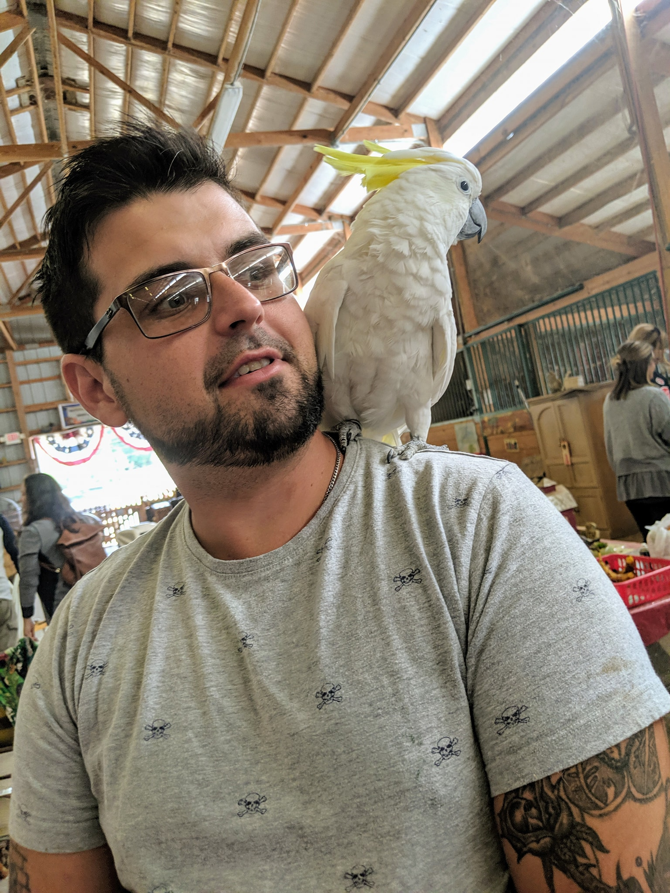
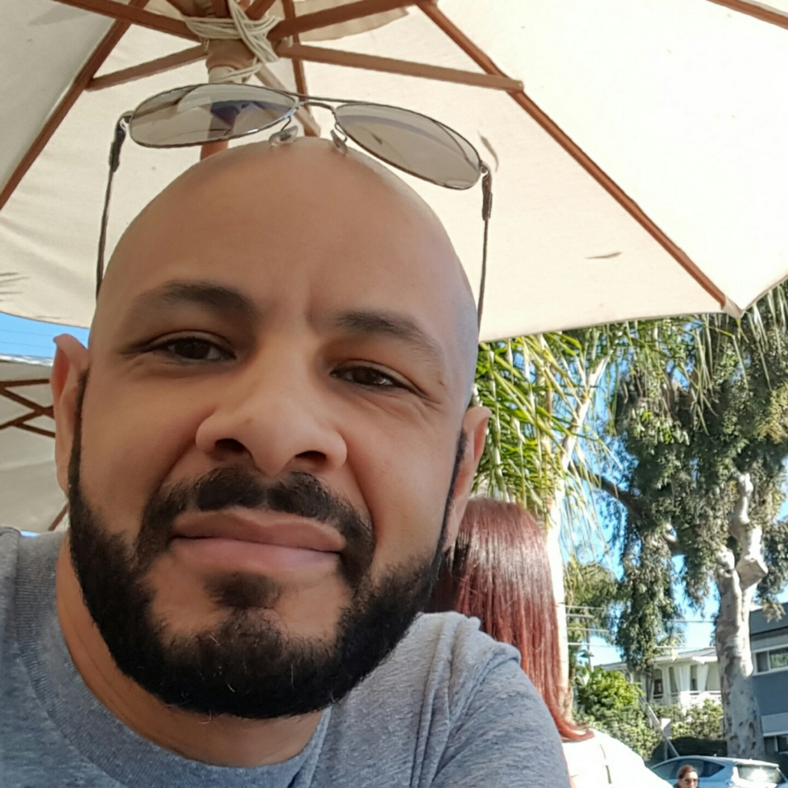

# DigitalCrafts 9/22/2020 Photo Album

## Students

### Matt Brown

# Name: Matt Brown

## Birthday: 09/15/1987

## From: Macon, Ga

## SSN: Just Joking

### Interests: Fishing, Kayaking, Reading, Woodworking, Welding, And last but not least, Learning to Code!

#### About Me: Growing up, I was never fully decided on what i wanted to do with my life. I was always quite undecided because everything I tried seemed to peak my interest to some degree at minimum. I worked at a Vet for about 6 years. So, naturally, i wanted to be a Vet. i loved working with animals, and i learned quite a bit from my time there. Then, always being an avid outdoorsman, I decided that ABAC would be the college for me, and i wanted to deal with Forrestry. For those who dont know what ABAC is, its pretty much the most country college the world has ever known. So country in fact, that they have a raccoon hunting club. I was of course a proud member, and for a short time a vice president of the club. Well, due to me coon hunting a little bit too much, my grades slipped, and my parents didnt believe i was taking school seriously, so tuition funding was stopped and back to Macon I went. Just a few credits shy of a degree.

#### So stuck at home, and in need for further education, i decided my best bet was to go to a technical college and get a degree in a certain trade. After careful consideration, i decided to tackle the adventure of Welding. Interesting enough, and would pay pretty well if i got a job in the field. So thats what i did for quite some time. But now, as i start to get a little bit older(33, but physical labor makes me feel like im about 55) Ive decided that all that hard work was okay when i was younger, but theres no way i can keep doing this until i retire. So i began to search for a better future, Thats when, My brother in law found DigitalCrafts. I watched him go from a basic job as a waiter, to a well paid, and job loving developer within a year. I was inspired. So i gathered the necessary resources, checked to see if i would be able to handle the material, and here I am. I couldnt be more excited for myself and my future. I'm very much looking forward to every part of this school, as well as what my future will hold if i strive, and apply myself.

### Rashad
Born and raised in Richmond, Va. I turned 30 years old on June 21st, and I haven't felt the same since! All jokes aside, I enjoy reading books on business, investing, and behavioral psychology. Thinking, Fast and Slow is one of my favorite books, I definitely recommend it to anyone that hasn't read it. Running is also a hobby of mine. I was preparing to run in my first marathon, but it was postponed due to COVID-19. Traveling is another hobby of mine, I enjoy visting new countries, and discovering diifferent foods and cultures. 

### Domineke Beard
Its your Boy Sketch back at it again. 

# Who is Domineke L Beard?
## A young **gamer**, an old **skater**, and a *midlife crisis* bound worker.
### As the title suggests who am I really? At 26 I am still a young man, and video games have always been my life. As a teenager I loved skateboarding, and my knees have never ~~forgiven~~ me for it. As an adult I have always worked hard to take care of myself and my ladies, but I can sense the midlife crisis on its way!!!
### So let us stave that off for now with a little bit of hard work, and a lot of determination towards my goals that are far past this certification. My own Gaming Company. 

### Hannelore

### Chad

### Larry

# 
Who am I?

PS.  Here's an image of my ugly mug.

***
This is generally a tough question to answer, but I will give it the old college try.

## The Basics
   * __Name__ - Larry McFarland
   * __Hometown__ - Atlanta, GA
   * __Current City__ - Canton, GA
   * __College__ - Georgia Tech (Go Jackets!)
   * __Occupation__ - Project Manager at [WrightNow Solutions](https://www.wrightnowsolutions.com)

## The Basics +
   * Veteran
   * Widower
   * Introvert
   * Green
   * Geek
   * Philosopher
   * Punster
   * Traveler

## Advanced
   * __Veteran__
     * U.S. Navy Veteran
     * Lieutenant Commander
     * 7 deployments

   * __Widower__
     * January 24, 2020
     * Too soon to talk about it

   * __Introvert__
     * Enjoy solitude in nature
     * Love working from home
     * Generally prefer my six cats to people (present company excluded)

     * __Green__
     * Recycle almost everything
     * Support ecological causes        
     * Strive to keep the earth healthy  

   * __Geek__
     * Makes me a good fit for this program
     * Have a lot of tech
     * Choose nerdy computer glasses on purpose

   * __Philosopher__
     * Love to find the meaning of things when possible
     * Like to explore others' frames of reference
     * Believe in equity, equality, and humane treatment of all others

   * __Punster__
     * Expect many groaners!
     * Like to be clever with jokes
     * Like to make people smile

   * __Traveler__
     * Lived abroad in Japan and Bahrain
     * Been around the earth in the air and on the surface
     * Would like to go to New Zealand and Scotland

##  Mantras
   > Never criticize anyone until you've walked a mile in their moccasins. - Indian Proverb

   > Dance like nobody's watching.

   > What you think you become. - Buddha

##  So... Who am I?
   Many things - a complex individual with a past, present, and future.  This I have in common with all of humanity.  I look forward to learning more about my classmates and the DigitalCrafts team, and I look forward to learning more about myself along the journey.

   Peace

## Instructors

### Dre Taylor
Dre was here

### Andy Schmidt

#### Hi evervybody this is me

