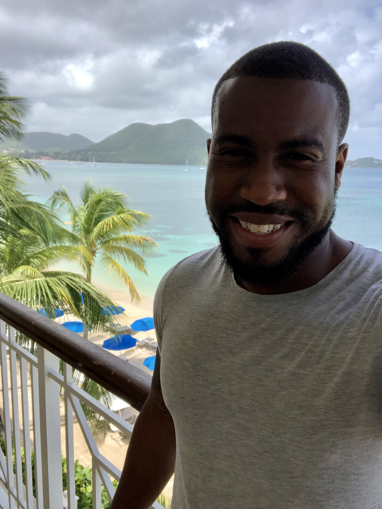

# DigitalCrafts 922 Photo Album

## Students

### Matt Brown

### Rashad
Born and raised in Richmond, Va. I turned 30 years old on June 21st, and I haven't felt the same since! All jokes aside, I enjoy reading books on business, investing, and behavioral psychology. Thinking, Fast and Slow is one of my favorite books, I definitely recommend it to anyone that hasn't read it. Running is also a hobby of mine. I was preparing to run in my first marathon, but it was postponed due to COVID-19. Traveling is another hobby of mine, I enjoy visting new countries, and discovering diifferent foods and cultures. 

### Domineke Beard

### Hannelore

### Chad 

## Instructors

### Dre Taylor

### Andy Schmidt