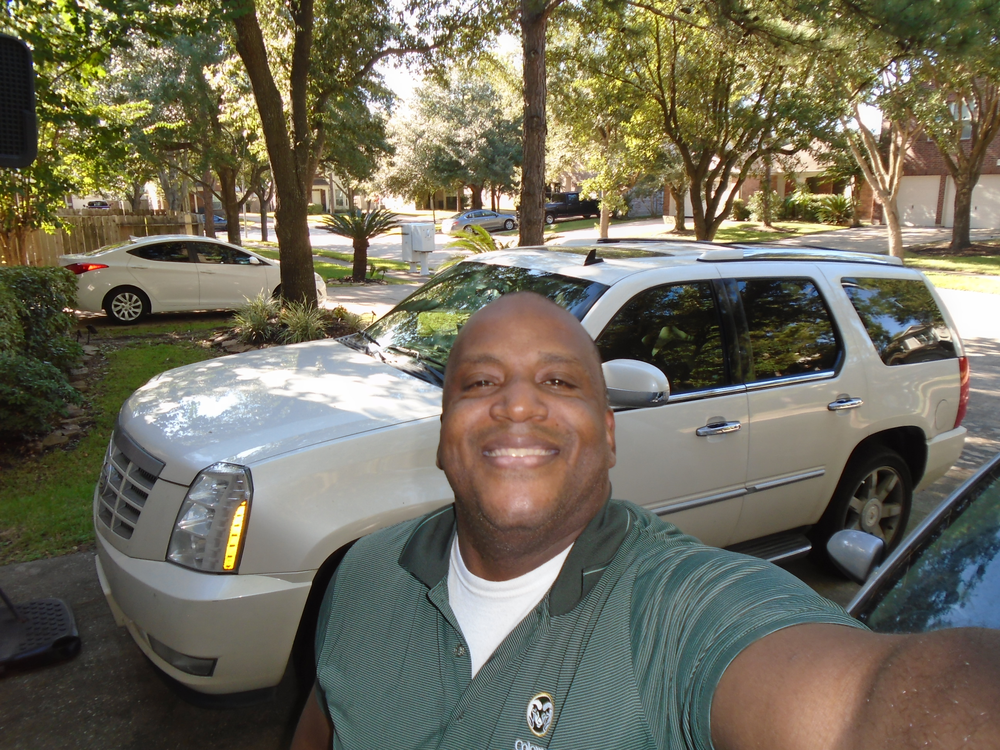

# Luqman L. Taleem

Hello Class, my name is Luqman L. Taleem, but I would like for everyone to call me Luke.
I was born and raise in Whittier, California, but moved to Houston, Texas in 2007. 

## My Personal Goals For Taking This Course

I am taking this web development course with Digitalcrafts because my employer, Kindred
Healthcare Inc. has requested me to join there corporate web development team to help
build our new company website to be rolled out in September 2022. I was selected to join
our corporate web development team due to my Electronic Engineering educational backgroud
and nursing education backgroud. Co-workers call me Digi-Nurse

## Education

Certificate of Completion, Licensed Vocational Nursing, Glendale Career College,
Glendale, California, 2003

Bachelors of Science, Electronic Engineering, Southern California Institute of Technology, Anahiem, California, 2007

Masters of Business Adminstration (MBA), Keller Graduate School of Management, Houston,
Texas, 2009

Professional Graduate Certificate, Systems Engineering, Colorado State University,
Fort Collins, Colorado, 2015 

## Personal Hobbies

Backyard grilling, Basketball, Football, Programming (C and C++), Raising a Family. 